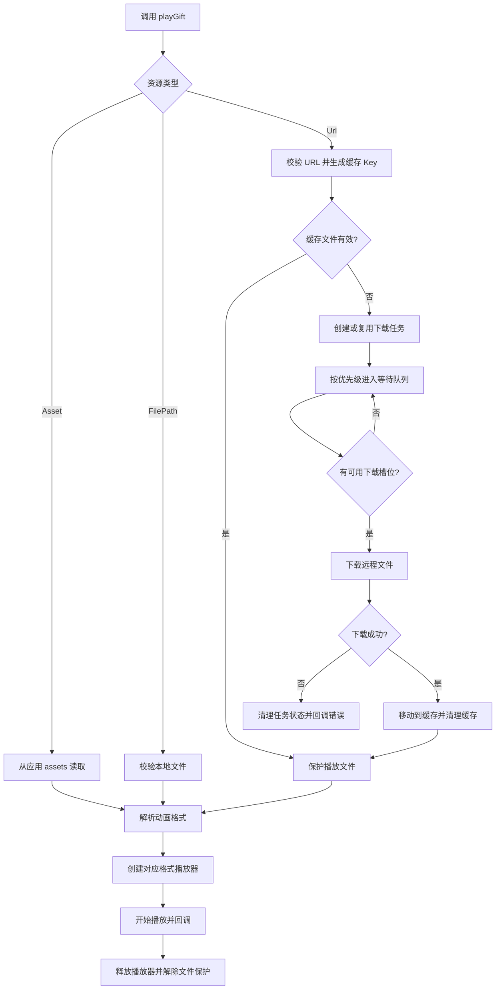

# GiftPlayer 项目能力基线与库交付

## 目标

基于当前代码整理 GiftPlayer 的产品能力和技术边界，为后续作为 Android 动画库发布和被其他项目引用提供明确依据。项目面向礼物动画、房间特效和后续房间控件场景，包含多格式播放、远程下载、本地资源播放、缓存管理、下载优先级和批量预加载能力。

## 当前项目现状

- 项目包含两个 Gradle 模块：`giftplayer` 是可发布的 Android 库，`app` 是 Demo 应用。
- 支持 SVGA、PAG、VAP 三种动画格式。
- 支持 `AnimationSource.Url`、`AnimationSource.Asset` 和 `AnimationSource.FilePath`。
- 只有 URL 资源需要下载优先级，Asset 和 FilePath 不进入下载调度器。
- URL 播放会先检查缓存，缓存无效时才创建或复用下载任务。
- 支持下载并发数、缓存目录、缓存大小、缓存有效期和日志开关配置。
- 支持相同 URL 的任务复用和多个回调合并。
- 支持播放期间保护缓存文件，避免缓存清理误删正在播放的文件。
- 已提供批量预加载接口：`AnimationResourceManager.preload(context, resources, callback)`。
- 当前最低支持 Android API 24，Java 兼容版本为 11。

## 功能要求

### 动画播放

- 为 URL、Asset 和 FilePath 提供统一的播放模型。
- 支持自动识别格式，也支持显式指定 SVGA、PAG 和 VAP。
- URL 播放必须在资源下载完成并校验有效后开始播放。
- Asset 播放直接读取调用方应用的 `src/main/assets`，不能触发网络下载。
- 支持音频开关、循环次数、播放完成回调和错误回调。
- 播放结束或失败后，应释放播放器资源并解除文件保护。

### 下载和缓存

- 支持 `Highest`、`High`、`Medium`、`Low` 四级下载优先级。
- 优先级只影响等待队列中的任务，不打断已经开始的下载。
- 下载槽位释放后，优先执行队列中优先级更高的任务。
- 相同 URL 再次请求时复用已有任务，避免重复下载。
- 下载成功后将临时文件移动到缓存目录，并执行缓存清理策略。
- 下载失败后清理活动任务状态，并通过回调返回错误。
- 缓存清理不能删除正在播放且已被保护的文件。

### 批量预加载

- 批量预加载必须复用普通下载流程。
- 批量任务继续遵守缓存检查、优先级、并发限制和 URL 去重规则。
- `preload` 返回每个资源对应的 `AnimationDownloadTask`，调用方可以保存并取消任务。
- 批量预加载不能绕过下载调度器，也不能阻塞主线程。

### 发布和 Demo

- 公共类、方法和参数命名应清晰表达动画业务含义。
- 内部实现尽量使用 `internal` 或包内可见，减少发布 API 暴露。
- README 中的安装、初始化、播放、批量预加载和优先级示例必须与源码一致。
- 库应支持通过 Maven/JitPack 坐标被外部 Android 项目引用。
- Demo 应演示远程 URL 和本地 Asset 播放，并提供格式、音频、循环和日志验证入口。
- `MainActivity` 继承 `AppCompatActivity` 时必须使用 AppCompat 主题。

## 下载与播放流程

## 验收标准

- [ ] 可以初始化库并播放远程 URL 动画。
- [ ] 可以播放调用方 `src/main/assets` 中的动画文件。
- [ ] README 记录的 SVGA、PAG、VAP 能力与代码一致。
- [ ] URL 播放优先使用有效缓存，不重复创建活动下载。
- [ ] URL 下载遵守并发数量和等待队列优先级。
- [ ] 批量预加载可以接收多个 `AnimationResource` 并返回任务句柄。
- [ ] 缓存清理不会删除正在播放的受保护文件。
- [ ] 下载或播放失败会触发错误回调并清理失效任务。
- [ ] Demo 可以演示远程 URL 和本地 Asset 播放。
- [ ] `:app:assembleDebug` 和 `:giftplayer:publishToMavenLocal` 通过。
- [ ] README 的安装方式和 API 示例与实际源码一致。

## 不包含内容

- 服务端礼物目录、房间业务模型和登录鉴权。
- 签名 URL、CDN 服务和播放引擎替换。
- 完整的生产级房间控件 UI 框架。
- GitHub 账号配置、远程推送和 Release 发布操作。

## 技术文件

- 下载缓存：`giftplayer/src/main/java/com/keke/giftplayer/animation/download/AnimationResourceManager.kt`
- 资源模型：`giftplayer/src/main/java/com/keke/giftplayer/animation/core/AnimationSource.kt`
- 资源解析：`giftplayer/src/main/java/com/keke/giftplayer/animation/loader/AnimationSourceResolver.kt`
- 播放集成：`giftplayer/src/main/java/com/keke/giftplayer/animation/widget/AnimationPlayerView.kt`
- 基础播放：`giftplayer/src/main/java/com/keke/giftplayer/animation/widget/BaseAnimationPlayerView.kt`
- 下载优先级：`giftplayer/src/main/java/com/keke/giftplayer/animation/download/AnimationDownloadPriority.kt`
- 发布配置：`giftplayer/build.gradle.kts`
- Demo 依赖：`app/build.gradle.kts`
