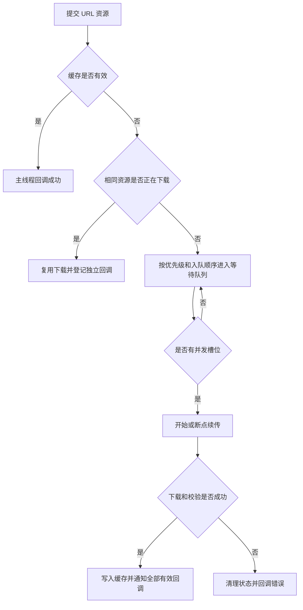
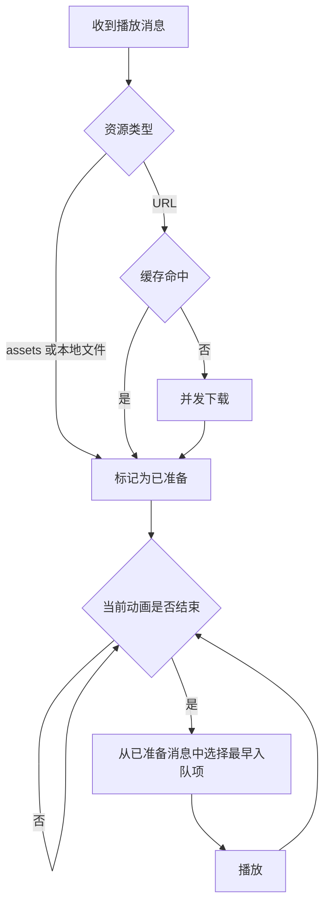

# GiftPlayer

GiftPlayer 是一个 Android 礼物动画与房间特效 SDK。它提供统一的 SVGA、PAG、VAP 播放接口，并内置 URL 下载、缓存、优先级调度、批量预加载和顺序播放能力。

## 支持能力

- 支持 SVGA、PAG、VAP 动画
- 支持远程 URL、`assets` 和本地文件
- 支持单动画播放和消息队列播放
- 支持并发下载、四级优先级和批量预加载
- 相同资源共享下载任务，避免重复流量
- 支持缓存命中、MD5 校验、容量清理和过期清理
- 支持断点续传和弱网超时配置
- 支持播放、下载进度和错误回调
- 支持 Logcat 和业务自定义日志接收器

## 环境要求

- Android `minSdk 24`
- JDK 11
- 在 `AndroidManifest.xml` 中声明网络权限：

```xml
<uses-permission android:name="android.permission.INTERNET" />
```

## 引入依赖

在接入工程的 `settings.gradle.kts` 中添加 JitPack：

```kotlin
dependencyResolutionManagement {
    repositoriesMode.set(RepositoriesMode.FAIL_ON_PROJECT_REPOS)
    repositories {
        google()
        mavenCentral()
        maven("https://jitpack.io")
    }
}
```

`FAIL_ON_PROJECT_REPOS` 表示所有仓库都在 `settings.gradle.kts` 统一管理。如果工程已有其他仓库管理策略，只需确保 `https://jitpack.io` 可用。

在 App 模块中添加依赖：

```kotlin
dependencies {
    implementation("com.github.KeShiJie.GiftPlayer:giftplayer:v2.0.0")
}
```

请将版本号替换为 GitHub Releases 中实际发布的 Tag。

## 初始化

SDK 只需要初始化一次。建议在 `Application.onCreate()` 中完成：

```kotlin
class App : Application() {
    override fun onCreate() {
        super.onCreate()
        GiftPlayer.initialize(this)
    }
}
```

需要自定义下载、缓存或日志时：

```kotlin
GiftPlayer.initialize(
    context = this,
    config = GiftPlayerConfig(
        maxConcurrentDownloads = 2,
        maxCacheSizeBytes = 300L * 1024L * 1024L,
        connectTimeoutMillis = 20_000,
        readTimeoutMillis = 30_000,
        downloadTimeoutMillis = 180_000L,
        logcatEnabled = BuildConfig.DEBUG,
    ),
)
```

重复调用 `initialize()` 会被忽略。不要在每个 Activity 中重复初始化。

## 选择播放器

| 场景 | View | 行为 |
| --- | --- | --- |
| 页面只展示最新一条动画 | `GiftAnimationPlayerView` | 新请求替换当前请求 |
| 连续收到礼物或房间特效 | `GiftAnimationQueueView` | 资源并发准备，动画逐条播放 |

### 单动画播放器

```xml
<com.keke.giftplayer.animation.widget.GiftAnimationPlayerView
    android:id="@+id/playerView"
    android:layout_width="match_parent"
    android:layout_height="280dp" />
```

```kotlin
val playerView = findViewById<GiftAnimationPlayerView>(R.id.playerView)

playerView.play(
    AnimationRequest(
        source = AnimationSource.Url(
            url = "https://example.com/gift.svga",
            priority = AnimationDownloadPriority.Highest,
        ),
        format = AnimationFormat.Auto,
        loopCount = 1,
    ),
)
```

### 队列播放器

```xml
<com.keke.giftplayer.animation.widget.GiftAnimationQueueView
    android:id="@+id/queueView"
    android:layout_width="match_parent"
    android:layout_height="280dp" />
```

```kotlin
val queueView = findViewById<GiftAnimationQueueView>(R.id.queueView)

queueView.enqueue(
    AnimationRequest(
        source = AnimationSource.Url(
            url = animationUrl,
            priority = AnimationDownloadPriority.Highest,
        ),
    ),
)
```

队列采用 ready-first 规则：等待中的 URL 会并发准备；当前动画结束后，从已经准备好的消息中选择最早入队的一条播放。某条慢下载不会阻塞后面已经命中缓存或先下载完成的动画。

可以限制等待消息的有效期：

```kotlin
queueView.setQueueConfig(
    AnimationQueueConfig(messageTtlMillis = 60_000L),
)
```

TTL 只作用于等待消息，不会中断已经开始播放的动画。

## 本地资源

将文件放入接入工程的 `src/main/assets`：

```kotlin
playerView.play(
    AnimationRequest(
        source = AnimationSource.Asset("gift/say_hi.pag"),
        format = AnimationFormat.Pag,
    ),
)
```

播放本地文件：

```kotlin
playerView.play(
    AnimationRequest(
        source = AnimationSource.FilePath(file.absolutePath),
        format = AnimationFormat.Auto,
    ),
)
```

只有 `AnimationSource.Url` 会进入下载系统并使用下载优先级。

## AnimationRequest

```kotlin
AnimationRequest(
    source = AnimationSource.Url(url, AnimationDownloadPriority.Highest),
    format = AnimationFormat.Auto,
    loopCount = 1,
    autoPlay = true,
    scaleType = AnimationScaleType.FitCenter,
    fillMode = AnimationFillMode.Forward,
    enableAudio = true,
    pauseWhenInvisible = false,
)
```

| 参数 | 说明 |
| --- | --- |
| `source` | URL、assets 或本地文件路径 |
| `format` | `Auto`、`Svga`、`Pag`、`Vap` |
| `loopCount` | 播放次数 |
| `autoPlay` | 加载完成后是否自动播放 |
| `scaleType` | 动画缩放方式 |
| `fillMode` | 播放结束后的画面保留方式，目前主要用于 SVGA |
| `enableAudio` | 是否播放动画内置音频，目前用于 VAP |
| `pauseWhenInvisible` | View 不可见时是否暂停 |

## 播放回调

```kotlin
playerView.setCallback(object : AnimationCallback {
    override fun onLoadStart(request: AnimationRequest) = Unit
    override fun onStart(request: AnimationRequest) = Unit
    override fun onProgress(request: AnimationRequest, progress: Float) = Unit
    override fun onComplete(request: AnimationRequest) = Unit
    override fun onCancel(request: AnimationRequest) = Unit
    override fun onError(request: AnimationRequest, error: AnimationError) = Unit
})
```

Activity 或 Fragment 销毁时释放播放器：

```kotlin
override fun onDestroy() {
    playerView.release()
    super.onDestroy()
}
```

## 单个下载

```kotlin
val resource = AnimationResource(
    id = "gift_1001",
    url = animationUrl,
    version = "1",
    md5 = serverMd5,
    format = AnimationFormat.Svga,
    category = "gift",
    priority = AnimationDownloadPriority.High,
)

val task = GiftPlayer.download(resource, object : AnimationDownloadCallback {
    override fun onProgress(
        resource: AnimationResource,
        downloadedBytes: Long,
        totalBytes: Long,
    ) = Unit

    override fun onSuccess(resource: AnimationResource, file: File) = Unit
    override fun onError(resource: AnimationResource, error: Throwable?) = Unit
})

task.cancel()
```

回调在主线程执行。相同资源同时被多个调用方请求时会共享底层下载，但各自持有独立的 `AnimationDownloadTask`。一个调用方取消不会直接取消其他调用方仍需要的下载。

## 批量预加载

```kotlin
val resources = urls.map { url ->
    AnimationResource(
        url = url,
        priority = AnimationDownloadPriority.Low,
    )
}

val tasks = GiftPlayer.preload(resources, object : AnimationDownloadCallback {
    override fun onProgress(
        resource: AnimationResource,
        downloadedBytes: Long,
        totalBytes: Long,
    ) = Unit

    override fun onSuccess(resource: AnimationResource, file: File) = Unit
    override fun onError(resource: AnimationResource, error: Throwable?) = Unit
})

tasks.forEach(AnimationDownloadTask::cancel)
```

## 下载优先级

优先级从高到低：

```kotlin
AnimationDownloadPriority.Highest
AnimationDownloadPriority.High
AnimationDownloadPriority.Medium
AnimationDownloadPriority.Low
```

优先级只调整等待中的任务，不会抢占已经开始的下载。例如并发数为 2 时，两个 `High` 已开始下载，新的 `Highest` 会排在等待队列首位，并在任意下载槽释放后启动。



## 队列播放流程



## 缓存管理

```kotlin
val cached = GiftPlayer.isCached(resource)
val cachedFile = GiftPlayer.getCachedFile(resource)
val cacheSizeBytes = GiftPlayer.getCacheSize()

GiftPlayer.clearExpiredCache()
GiftPlayer.clearCache()
```

缓存查询和清理包含文件访问。数据量较大时应在工作线程调用，避免阻塞主线程。正在播放并受保护的文件不会被缓存清理误删。

## 弱网配置

默认值适用于最大约 5 MiB 的动画资源，并为海外弱网保留了足够时间：

| 配置 | 默认值 | 含义 |
| --- | ---: | --- |
| `connectTimeoutMillis` | 20 秒 | 建立连接超时 |
| `readTimeoutMillis` | 30 秒 | 单次等待读取数据超时 |
| `downloadTimeoutMillis` | 180 秒 | 开始下载后的总超时，不含排队时间 |
| `maxConcurrentDownloads` | 2 | 同时运行的下载数 |
| `resumeDownloadEnabled` | `true` | 是否允许断点续传 |
| `maxResumableFailureCount` | 3 | 连续续传失败后清理临时文件的阈值 |

## 自定义日志

Logcat 默认关闭。开启 Logcat 不影响自定义日志接收器，两者相互独立：

```kotlin
GiftPlayer.initialize(
    context = this,
    config = GiftPlayerConfig(
        logcatEnabled = BuildConfig.DEBUG,
        logger = GiftPlayerLogger { level, tag, message, throwable ->
            companyLogger.log(level.name, tag, message, throwable)
        },
    ),
)
```

即使 `logcatEnabled = false`，`logger` 仍然会收到日志。日志可能从多个线程同步回调，上传或写文件应转交到自己的异步队列。

SDK 会强引用日志接收器。请传入 Application 级对象，不要在闭包中捕获 Activity、Fragment 或 View。

运行期间可以调整：

```kotlin
GiftPlayer.setLogcatEnabled(false)
GiftPlayer.setLogger(null)
```

## 模块说明

- `giftplayer`：对外发布的 SDK，接入方只需要依赖此模块
- `app`：单播放、队列播放、assets 和批量下载示例
- `lib_download`：下载适配模块
- `filedownloader`：中台定制下载实现

下载实现保留为仓库内部模块，但通过 Maven 发布依赖关系传递给接入工程。业务项目不应该直接调用 `AnimationResourceManager` 或依赖下载实现模块，统一通过 `GiftPlayer` 使用下载和缓存能力。

## 源码查看

发布产物包含完整 `sources.jar`。Android Studio 正确下载并关联同版本源码后，可以直接查看 Kotlin 源码和注释。如果仍看到 `COMPILED_CODE`，通常是 IDE 尚未关联 sources，或者本地仍缓存旧版本。发布新代码时必须创建新的 Git Tag 和依赖版本，不要覆盖已发布 Tag。

## License

本项目使用 MIT License。
