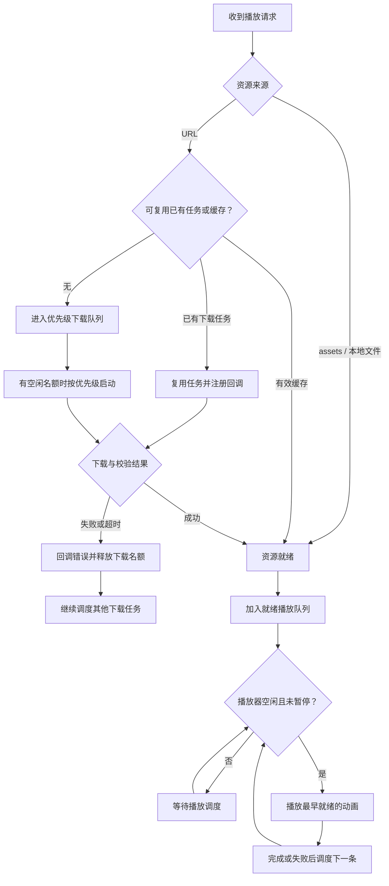

# GiftPlayer

GiftPlayer 是一个 Android 动画播放库，适用于礼物动画和房间特效。它把 SVGA、PAG、VAP 三种格式的播放方式统一起来，同时处理资源下载、缓存和播放排队。

**第一次接入：先看「快速接入」播放一条动画，再根据业务选择单次播放或队列播放。**

本文说明当前仓库代码的能力。通过 Maven 接入时，请使用包含相应功能的已发布版本。

## 目录

- [快速接入](#快速接入)
- [如何选择播放器](#如何选择播放器)
- [播放请求参数](#播放请求参数)
- [本地资源播放](#本地资源播放)
- [队列播放](#队列播放)
- [播放回调](#播放回调)
- [日志打印与上传](#日志打印与上传)
- [下载配置与弱网超时](#下载配置与弱网超时)
- [单个下载与批量预加载](#单个下载与批量预加载)
- [下载优先级与流程](#下载优先级与流程)
- [缓存管理](#缓存管理)
- [常见问题](#常见问题)
- [模块与发布](#模块与发布)

## 支持能力

- **多格式播放**：支持 SVGA、PAG、VAP，支持按文件扩展名自动选择格式。
- **多种资源来源**：支持远程 URL、应用 assets 和本地文件路径。
- **单次播放**：新请求替换旧请求，适合只展示最新动画的场景。
- **队列播放**：资源并发准备、动画逐个播放，缓存命中的资源可先播放。
- **下载和批量预加载**：支持并发限制、四级优先级、相同资源下载复用和独立取消。
- **缓存管理**：支持自定义目录、容量清理、过期清理和可选 MD5 校验。
- **弱网配置**：支持断点续传、连接超时、读取超时和单次下载总超时。
- **回调与日志**：提供播放事件、下载结果回调及可配置日志。
- **示例工程**：包含单播放器、队列播放和本地资源使用示例。

## 快速接入

最低支持 Android 7.0（API 24）。

### 1. 添加仓库和依赖

在接入项目的 `settings.gradle.kts` 中添加 JitPack：

```kotlin
dependencyResolutionManagement {
    repositoriesMode.set(RepositoriesMode.FAIL_ON_PROJECT_REPOS)
    repositories {
        google()
        mavenCentral()
        maven("https://jitpack.io")
    }
}
```

`FAIL_ON_PROJECT_REPOS` 表示统一在 settings 中管理依赖仓库；子模块再声明仓库时会报错。已有项目请结合自己的仓库管理方式配置。

在应用模块的 `build.gradle.kts` 中添加：

```kotlin
dependencies {
    implementation("com.github.KeShiJie.GiftPlayer:giftplayer:<version>")
}
```

将 `<version>` 替换为 JitPack 构建成功的完整 GitHub Tag，包含实际存在的 `v` 前缀。
`lib_download` 和 `filedownloader` 会作为传递依赖引入，无需手动复制 AAR。

版本和构建日志：[JitPack](https://jitpack.io/#KeShiJie/GiftPlayer)。

### 2. 初始化

建议在 `Application.onCreate()` 中初始化：

```kotlin
import android.app.Application
import com.keke.giftplayer.animation.AnimationInitializer

class DemoApplication : Application() {
    override fun onCreate() {
        super.onCreate()
        AnimationInitializer.init(this)
    }
}
```

在应用的 Manifest 中注册 `DemoApplication`。如果项目已有 Application，请将初始化调用加到现有的 `onCreate()`，不必再创建一个。默认不打印日志，其余配置可先保持默认。

### 3. 添加播放器并播放

在 Activity 的布局中加入播放器：

```xml
<com.keke.giftplayer.animation.widget.BaseAnimationPlayerView
    android:id="@+id/playerView"
    android:layout_width="match_parent"
    android:layout_height="300dp" />
```

在 Activity 的 `setContentView()` 之后获取 View 并播放：

```kotlin
import com.keke.giftplayer.animation.core.AnimationFormat
import com.keke.giftplayer.animation.core.AnimationRequest
import com.keke.giftplayer.animation.core.AnimationSource
import com.keke.giftplayer.animation.download.AnimationDownloadPriority
import com.keke.giftplayer.animation.widget.BaseAnimationPlayerView

val playerView = findViewById<BaseAnimationPlayerView>(R.id.playerView)
playerView.play(
    AnimationRequest(
        source = AnimationSource.Url(
            url = "https://s1.videocc.net/default-img/donate-svga/diamond.svga",
            priority = AnimationDownloadPriority.Highest,
        ),
        format = AnimationFormat.Svga,
        loopCount = 1,
    ),
)
```

运行后，播放器会先检查缓存，没有缓存就下载，资源准备好后播放。

## 如何选择播放器

| 你的需求 | 使用的 View | 调用方法 | 新请求到来时 |
| --- | --- | --- | --- |
| 只显示最新一条动画 | `BaseAnimationPlayerView` | `play(request)` | 替换上一条请求 |
| 连续收到礼物消息，每条都需要播放 | `QueuedAnimationPlayerView` | `enqueue(request)` | 准备资源并排队，不打断当前动画 |

**连续礼物消息建议使用队列播放器。** 不要用单次播放器的多次 `play()` 模拟队列，否则后来的请求会替换前面的请求。

后面的代码片段默认已在 Activity 或 Fragment 中取得相应 View；示例中的 URL、资源列表和本地文件由接入项目提供。播放与 View 控制请在主线程调用。

## 播放请求参数

`AnimationRequest` 描述「播放哪个资源，以及如何播放」。单次播放器的 `play(request)` 和队列播放器的 `enqueue(request)` 使用同一个请求类型。

### 参数说明

| 参数 | 默认值 | 说明 |
| --- | --- | --- |
| `source` | 必填 | 资源来源：`AnimationSource.Url`、`Asset` 或 `FilePath` |
| `format` | `AnimationFormat.Auto` | 根据扩展名识别格式；也可指定 `Svga`、`Pag` 或 `Vap` |
| `loopCount` | `1` | 播放次数；队列场景建议使用有限次数，避免阻塞后续动画 |
| `autoPlay` | `true` | 加载完成后自动播放 |
| `scaleType` | `AnimationScaleType.FitCenter` | 等比例缩放，完整显示并居中；还支持 `CenterCrop`（等比例填满并裁剪）和 `FitXY`（拉伸填满） |
| `fillMode` | `AnimationFillMode.Forward` | 结束后保留最后一帧；当前仅 SVGA 使用，还支持 `Backward` 和 `Clear` |
| `enableAudio` | `true` | 是否播放内置音频；当前仅 VAP 使用此开关，不能用它统一控制所有格式静音 |
| `pauseWhenInvisible` | `false` | View 不可见时是否暂停播放 |

下载优先级放在 `AnimationSource.Url.priority` 中，不是 `AnimationRequest` 的参数；本地资源不需要下载优先级。

### 配置示例

```kotlin
import com.keke.giftplayer.animation.core.AnimationScaleType

val request = AnimationRequest(
    source = AnimationSource.Url(
        url = animationUrl,
        priority = AnimationDownloadPriority.Highest,
    ),
    format = AnimationFormat.Vap,
    loopCount = 1,
    autoPlay = true,
    scaleType = AnimationScaleType.FitCenter,
    enableAudio = false,
    pauseWhenInvisible = true,
)

// 单次播放：替换上一条请求
playerView.play(request)

// 队列播放时改用：queuedPlayerView.enqueue(request)
```

示例中的 `animationUrl` 需要指向有效的 VAP 动画文件。普通 MP4 视频不等于 VAP 资源。

队列场景建议保持 `autoPlay = true`，让资源准备完成后自动播放并推进队列。PAG、VAP 的恢复播放目前会重新启动动画，并非精确续播。

## 本地资源播放

### assets 文件

将文件放入应用的 `src/main/assets/` 目录，路径相对于 assets 根目录：

```kotlin
playerView.play(
    AnimationRequest(
        source = AnimationSource.Asset("say_hi.pag"),
        format = AnimationFormat.Pag,
    ),
)
```

### 本地文件

```kotlin
playerView.play(
    AnimationRequest(
        source = AnimationSource.FilePath(localFile.absolutePath),
        format = AnimationFormat.Svga,
    ),
)
```

只有 `AnimationSource.Url` 配置下载优先级；assets 和本地文件直接准备播放。

## 队列播放

连续收到多条动画消息时，使用 `QueuedAnimationPlayerView`：

```xml
<com.keke.giftplayer.animation.widget.QueuedAnimationPlayerView
    android:id="@+id/queuedPlayerView"
    android:layout_width="match_parent"
    android:layout_height="300dp" />
```

```kotlin
val queuedPlayerView = findViewById<QueuedAnimationPlayerView>(R.id.queuedPlayerView)
queuedPlayerView.enqueue(
    AnimationRequest(
        source = AnimationSource.Url(urlA, AnimationDownloadPriority.Highest),
        loopCount = 1,
    ),
)
queuedPlayerView.enqueue(
    AnimationRequest(
        source = AnimationSource.Url(urlB, AnimationDownloadPriority.Highest),
        loopCount = 1,
    ),
)
```

### 谁准备好，谁先播放

这里的「就绪」指资源已可用于播放，并不代表已经完成解码。举个例子：

| 时间 | 发生的事情 | 播放器行为 |
| --- | --- | --- |
| 第一步 | 收到 A，A 需要下载 | 开始下载 A |
| 第二步 | 收到 B，B 已有缓存 | 播放器空闲时先播放 B，不等 A |
| 第三步 | A 下载完成，B 还没播完 | A 等待，B 不会被打断 |
| 第四步 | B 播放结束 | 播放 A |

其他规则：

- 多条消息可以同时准备资源，下载并发受 `maxConcurrentDownloads` 限制。
- 按资源就绪顺序逐个播放，不保证消息接收顺序。
- A 正在下载、B 已有缓存时，播放器空闲即可先播放 B。
- A 下载完成时如果 B 仍在播放，A 会等待 B 结束。
- 新就绪的动画不会打断当前动画。
- 同一资源的多条消息可以共享下载，但仍保留各自的播放次数。
- 下载、解码或播放失败后回调错误，继续调度其他就绪消息。
- 队列的 `play(request)` 等同于 `enqueue(request)`。

### 等待消息过期

默认不限制等待时长，也可为之后入队的消息配置有效期：

```kotlin
queuedPlayerView.setQueueConfig(
    AnimationQueueConfig(messageTtlMillis = 180_000L),
)
```

有效期从入队开始计算，约束等待阶段；已经交给播放器的消息不再因该有效期过期。
`null` 表示不过期，非空值必须大于 0。过期通过 `onError` 回调 `AnimationError.Cancelled`。
消息有效期与下载总超时是两个独立配置。

### 播放控制

```kotlin
queuedPlayerView.pause()
queuedPlayerView.resume()
queuedPlayerView.clearQueue()       // 清理等待消息，保留当前播放
queuedPlayerView.stop(clear = true) // 停止当前播放并清理队列
queuedPlayerView.release()          // 释放该 View 持有的资源
```

队列 View 脱离窗口时会自动释放。释放后的实例不应继续接收播放请求。
需要继续播放后续消息时，请使用有限循环次数，避免无限循环占用播放器。

## 播放回调

单次播放器和队列播放器都通过 `setCallback()` 设置回调：

```kotlin
playerView.setCallback(object : AnimationCallback {
    override fun onStart(request: AnimationRequest) {
        // 开始播放
    }

    override fun onComplete(request: AnimationRequest) {
        // 本条播放完成
    }

    override fun onError(request: AnimationRequest, error: AnimationError) {
        // 处理下载、解码或渲染等错误
    }
})
```

还支持 `onLoadStart`、`onProgress`、`onRepeat` 和 `onCancel`。
队列回调保留原始请求，便于关联 URL 和业务消息。

## 日志打印与上传

**打印到 Logcat 和回调给业务是独立的：默认不打印，但设置监听器后仍会收到日志。**

| 初始化的 `isLogEnabled` | 是否设置监听器 | Logcat 打印 | 业务收到回调 |
| --- | --- | --- | --- |
| `false`（默认） | 否 | 否 | 否 |
| `false` | 是 | 否 | 是 |
| `true` | 否 | 是 | 否 |
| `true` | 是 | 是 | 是 |

通过 `AnimationLog.setListener()` 接收动画库日志，可对接公司日志 SDK、文件日志或异步上传队列：

```kotlin
import com.keke.giftplayer.animation.core.AnimationLog
import com.keke.giftplayer.animation.core.AnimationLogListener

// 默认不打印；需要 Logcat 时在初始化配置中显式开启
AnimationInitializer.init(
    context = applicationContext,
    isLogEnabled = false,
    logListener = AnimationLogListener { level, tag, message, throwable ->
        // 转交业务日志 SDK 或异步队列，在业务侧完成上传
        // level 对应 android.util.Log.INFO / WARN / ERROR 等常量
    },
)

// 后续可独立调整打印开关，不影响监听器
AnimationLog.setLogcatEnabled(false)

// 不再需要接收时移除监听器
// AnimationLog.setListener(null)
```

- 默认不打印 Logcat；通过 `AnimationInitializer.init(..., isLogEnabled = true)` 开启打印。
- 初始化的 `isLogEnabled`、`AnimationLog.setEnabled()` 和 `setLogcatEnabled()` 都只控制 Logcat 打印，不影响监听器。
- 设置监听器后，即使 `isLogEnabled = false` 也会收到日志；停止回调需调用 `setListener(null)`。
- 监听器为全局单个实例；每次调用 `AnimationInitializer.init()` 都会应用传入的日志配置，省略 `logListener` 会清除旧监听器。建议只在 Application 中统一初始化。
- 运行期间可用 `AnimationLog.setListener()` 替换监听器；单独调用 `AnimationResourceManager.init()` 更新下载配置不会修改日志设置。
- 回调在产生日志的线程同步执行，可能并发调用。业务方应保证线程安全，不要在回调中直接执行网络上传或耗时磁盘操作。
- 回调抛出的普通异常会被隔离；同一线程在回调中再次调用动画库日志会被忽略，避免递归。
- 监听器由全局对象持有，避免捕获 Activity 或 View；不再使用时传入 `null` 解除引用。
- 接口覆盖 `AnimationLog` 和库内默认 SVGA 日志输出，不会拦截 PAG、VAP、FileDownloader 等第三方依赖自行输出的日志。使用默认 SVGA 日志实现时，其打印开关关闭也不阻止监听器接收日志。
- 日志可能包含原始 URL、查询参数和本地路径，请在业务上传前按需脱敏。

旧版本迁移：将 `AnimationDownloadConfig(isLogEnabled = ...)` 中的参数移到 `AnimationInitializer.init(isLogEnabled = ...)`。下载配置的构造参数已发生变化，接入工程和依赖该配置的其他模块需要重新编译。

## 下载配置与弱网超时

以下是可选配置，用于替换快速接入中的默认初始化调用，无需重复初始化：

```kotlin
AnimationInitializer.init(
    context = applicationContext,
    downloadConfig = AnimationDownloadConfig(
        maxConcurrentDownloads = 2,
        maxCacheSizeBytes = 300L * 1024L * 1024L,
        connectTimeoutMillis = 20_000,
        readTimeoutMillis = 30_000,
        downloadTimeoutMillis = 180_000L,
    ),
)
```

主要类所在包：

- `com.keke.giftplayer.animation.AnimationInitializer`
- `com.keke.giftplayer.animation.core`：播放请求、资源来源、格式、回调和队列配置。
- `com.keke.giftplayer.animation.download`：下载配置、优先级、资源描述和资源管理器。
- `com.keke.giftplayer.animation.widget`：播放器 View。

### 下载配置

| 参数 | 默认值 | 说明 |
| --- | --- | --- |
| `customCacheDir` | `null` | 自定义缓存目录；为空时使用应用 cacheDir 下的目录 |
| `cacheDirName` | `animation` | 默认缓存目录名 |
| `maxCacheSizeBytes` | 300 MiB | 缓存清理容量阈值 |
| `maxCacheAgeMillis` | 30 天 | 缓存过期清理阈值，单位毫秒 |
| `maxConcurrentDownloads` | 2 | 同时执行的下载数量 |
| `clearExpiredOnInit` | `true` | 初始化时清理过期及超容量缓存 |
| `enableResumeDownload` | `true` | 启用断点续传 |
| `maxResumableFailureCount` | 3 | 连续续传失败达到阈值时清理临时文件，不是自动重试次数 |
| `autoSetupFileDownloader` | `true` | 自动初始化 FileDownloader；关闭后需自行初始化 |
| `connectTimeoutMillis` | 20,000 | 连接超时，单位毫秒 |
| `readTimeoutMillis` | 30,000 | 等待网络数据的读取超时，单位毫秒 |
| `downloadTimeoutMillis` | 180,000 | 单次下载总超时，单位毫秒 |

三个超时值必须大于 0。读取超时不是整个文件的下载时限；总超时从实际启动下载开始计时，不包含调度排队时间。自定义连接工厂需自行配置网络连接和读取超时。

默认缓存位于应用私有缓存目录，无需申请共享存储权限。自定义目录或本地文件应确保应用有访问权限。日志会记录原始播放 URL，包含查询参数；上传前应按需脱敏。默认关闭 Logcat 打印，设置监听器后仍会回调日志。

## 单个下载与批量预加载

预加载只准备缓存，不会自动播放，适合提前准备动画资源。

```kotlin
val resources = animationUrls.map { url ->
    AnimationResource(
        url = url,
        format = AnimationFormat.Auto,
        priority = AnimationDownloadPriority.Low,
    )
}

val downloadCallback = object : AnimationDownloadCallback {
    override fun onProgress(resource: AnimationResource, downloadedBytes: Long, totalBytes: Long) {
        // 更新单个文件进度；totalBytes <= 0 时显示已下载字节数或不确定进度条
    }

    override fun onSuccess(resource: AnimationResource, file: java.io.File) {
        // 命中有效缓存或下载成功；file 为可使用的本地文件
    }

    override fun onError(resource: AnimationResource, error: Throwable?) {
        // 处理该资源的下载或校验错误
    }
}

val tasks = AnimationResourceManager.preload(
    context = applicationContext,
    resources = resources,
    callback = downloadCallback,
)
```

回调在主线程执行，每个资源独立返回进度和结果；总大小已知时，可用已下载字节数除以总字节数计算百分比。缓存命中可能直接成功，不触发进度回调。当前没有独立的整批完成回调，可由业务统计成功和失败数量。
不需要结果时可省略 `callback`。

Demo 首页的「批量下载示例」可输入多行 URL，点击下载后查看逐项进度、缓存命中和批次完成数量，也可取消当前批次。重复 URL 会去重；退出页面会取消该页面的请求，重新进入后可利用缓存或断点续传。

单个下载：

```kotlin
val task = AnimationResourceManager.download(
    context = applicationContext,
    resource = resources.first(),
    callback = downloadCallback,
)
```

取消当前调用方的下载请求：

```kotlin
task.cancel()
tasks.forEach { it.cancel() }
```

同一资源被多个调用方共享时，取消只移除当前调用方；没有其他等待回调时才取消底层下载。

`AnimationResource` 还支持 `id`、`version`、`category` 和 `md5`。
提供 MD5 时会校验文件。下载复用基于资源键，并不只看 URL；使用自定义资源标识时，预加载和后续查询应保持一致。上述仅使用 URL 的预加载示例可与 URL 播放共享缓存。

## 下载优先级与流程

| 优先级 | 等级 | 顺序 |
| --- | --- | --- |
| `Highest` | 4 | 最高 |
| `High` | 3 | 高 |
| `Medium` | 2 | 中 |
| `Low` | 1 | 低 |

优先级只决定等待下载任务的调度顺序，不中断正在下载的任务。同级按入队顺序调度；相同资源被更高优先级请求时会提升已有任务的优先级。

例如：已有一批 High 任务，Highest 到来后会在下一个下载名额空闲时优先启动。随后再来两条不同资源的 Highest，不会打断正在运行的 Highest；有空闲名额则启动，否则按同级顺序等待。

下面展示队列播放器的资源准备和播放流程。单次播放器使用相同的下载调度，但新播放请求会替换旧请求。



下载优先级与播放顺序彼此独立：高优先级资源尚未下载完成时，低优先级但已就绪的动画仍可先播放。

## 缓存管理

```kotlin
val cachedFile = AnimationResourceManager.getCachedFile(applicationContext, resource)
val isCached = AnimationResourceManager.isCached(applicationContext, resource)
val cacheSizeBytes = AnimationResourceManager.getCacheSize()

AnimationResourceManager.clearExpired()
AnimationResourceManager.clearAll()
```

清理会避开正在使用或受保护的资源，因此容量阈值不是磁盘占用的硬上限，`clearAll()` 也不保证立即删除所有受保护文件。队列在资源就绪到播放结束期间维护缓存保护。

## 常见问题

### 为什么后来的动画先播放？

队列按资源准备好的顺序播放，不是严格按消息接收顺序播放。这样可以避免慢下载阻塞已经缓存的动画。下载优先级也不等于播放优先级。

### 不显示动画，先检查什么？

1. 在初始化配置中开启 `isLogEnabled`，或设置日志监听器查看下载和播放错误。
2. 通过 `onError` 区分下载失败、文件不存在、格式不支持和解码失败。
3. 确认 URL 返回的是动画文件而不是网页或鉴权错误；没有扩展名时显式设置 `format`。
4. 确认 View 有可见尺寸，本地文件存在，assets 路径正确。

默认使用应用私有缓存，不需要申请共享存储权限；使用自定义路径时再检查对应的访问权限。

### 30 秒读取超时，是整个文件只能下载 30 秒吗？

不是。读取超时限制等待读取网络数据的时间，整个下载默认允许 180 秒，而且不包含排队时间。队列消息的有效期是另一个独立配置，默认不过期。

### 三种格式的行为完全一样吗？

- `AnimationFormat.Auto` 基于扩展名判断格式；无扩展名链接建议显式指定格式。
- `.mp4` 按 VAP 处理，普通 MP4 不等同于 VAP 动画资源。
- `AnimationRequest` 支持循环次数、缩放模式、自动播放和不可见时暂停等配置，具体表现取决于播放引擎。
- 当前 `enableAudio` 开关由 VAP 适配器使用，不能认为所有格式都支持统一静音控制。
- 当前 `fillMode` 由 SVGA 适配器使用。
- PAG、VAP 的恢复播放目前会重新启动播放，并非精确从暂停位置继续。

## 模块与发布

| 模块 | 用途 |
| --- | --- |
| `app` | 示例应用 |
| `giftplayer` | 对外动画播放 API、队列及资源管理 |
| `lib_download` | FileDownloader 初始化和下载配置 |
| `filedownloader` | 将本地 FileDownloader AAR 发布为 Maven 制品 |

构建 Demo APK（此命令不会自动安装或启动应用）：

```bash
./gradlew :app:assembleDebug
```

本地验证 Maven 发布：

```bash
./gradlew -PreleaseVersion=local-check :filedownloader:publishToMavenLocal :lib_download:publishToMavenLocal :giftplayer:publishToMavenLocal
```

JitPack 通过 `jitpack.yml` 发布三个依赖模块。发布更新时，先提交代码，再创建指向该提交的新 Tag，并确认 JitPack 构建成功。不要移动已发布的 Tag 来覆盖旧版本。

当前源码附件包含 `AnimationDownloadConfig.kt`、`AnimationResourceManager.kt`、`BaseAnimationPlayerView.kt`、`QueuedAnimationPlayerView.kt`、`AnimationLog.kt` 和 `AnimationLogListener.kt`。接入项目需要让 Android Studio 下载并关联对应版本的 sources JAR，才能查看这些文件的原始代码和中文注释；`COMPILED_CODE` 是未关联源码时的反编译占位，不代表代码被混淆。

## 许可证

本项目采用 [MIT License](LICENSE)。第三方依赖遵循各自许可证。
