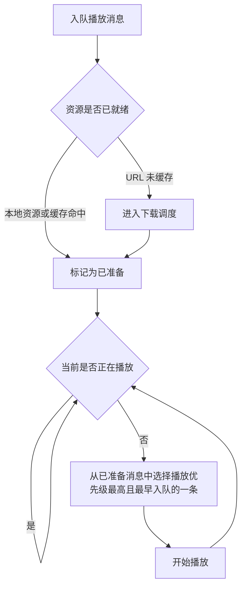
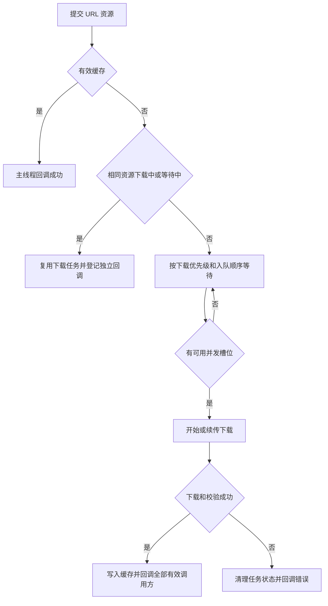

# GiftPlayer

GiftPlayer 是一个 Android 礼物动画和房间特效 SDK，提供统一的 SVGA、PAG、VAP 播放接口，以及 URL 下载、磁盘缓存、优先级调度、批量预加载和队列播放能力。

SVGA 已内置在核心模块中。PAG 和 VAP 采用可选插件模块，接入方可以自行选择实际使用的播放引擎及其版本。

## 功能

- 支持 SVGA、PAG、VAP 播放
- 支持远程 URL、`assets` 和本地文件
- 支持最新请求覆盖播放，以及礼物消息队列播放
- 支持下载优先级和播放优先级，二者相互独立
- 支持缓存命中、相同资源共享下载、MD5 校验和断点续传
- 支持单个下载、批量预加载和下载进度回调
- 支持缓存容量控制、过期缓存清理和缓存查询
- 支持弱网超时配置
- 支持 Logcat 和业务日志接收器

## 环境要求

- Android `minSdk 24`
- JDK 11
- 在 `AndroidManifest.xml` 中声明网络权限：

```xml
<uses-permission android:name="android.permission.INTERNET" />
```

## 引入依赖

在接入工程的 `settings.gradle.kts` 中添加 JitPack：

```kotlin
dependencyResolutionManagement {
    repositoriesMode.set(RepositoriesMode.FAIL_ON_PROJECT_REPOS)
    repositories {
        google()
        mavenCentral()
        maven("https://jitpack.io")
    }
}
```

`FAIL_ON_PROJECT_REPOS` 表示仓库统一在 `settings.gradle.kts` 中管理。如果项目使用其他仓库管理策略，只需确保可以访问 `https://jitpack.io`。

下面的 `VERSION` 应替换为 GitHub Release 对应的 Tag，例如 `v2.0.0`。同一次发布的 GiftPlayer 模块必须使用相同版本。

### 仅使用 SVGA

核心模块内置定制版 SVGA，无需额外引入 SVGAPlayer：

```kotlin
dependencies {
    implementation("com.github.KeShiJie.GiftPlayer:giftplayer:VERSION")
}
```

### 使用 PAG

PAG 引擎版本由接入方控制，适配插件不会传递 `libpag`：

```kotlin
dependencies {
    implementation("com.github.KeShiJie.GiftPlayer:giftplayer:VERSION")
    implementation("com.tencent.tav:libpag:4.5.75")
    implementation("com.github.KeShiJie.GiftPlayer:giftplayer-pag:VERSION")
}
```

### 使用 VAP

VAP 引擎版本同样由接入方控制，适配插件不会传递 VAP：

```kotlin
dependencies {
    implementation("com.github.KeShiJie.GiftPlayer:giftplayer:VERSION")
    implementation("io.github.tencent:vap:2.0.28")
    implementation("com.github.KeShiJie.GiftPlayer:giftplayer-vap:VERSION")
}
```

只引入实际使用的格式即可。当前项目编译验证的引擎版本为 `libpag 4.5.75` 和 `vap 2.0.28`；替换引擎版本后，请在目标设备完成播放验证。

## 初始化

在 `Application.onCreate()` 中初始化一次：

```kotlin
class App : Application() {
    override fun onCreate() {
        super.onCreate()
        GiftPlayer.initialize(this)
    }
}
```

使用 PAG 或 VAP 时，在初始化时注册已引入的插件：

```kotlin
GiftPlayer.initialize(
    context = this,
    plugins = listOf(
        PagPlayerPlugin(),
        VapPlayerPlugin(),
    ),
)
```

只播放 PAG 时，只添加 PAG 依赖并注册 `PagPlayerPlugin()`。未注册对应插件时，播放会回调 `AnimationError.PlayerPluginMissing(format)`。

初始化支持下载、缓存和日志配置：

```kotlin
GiftPlayer.initialize(
    context = this,
    config = GiftPlayerConfig(
        maxConcurrentDownloads = 2,
        maxCacheSizeBytes = 300L * 1024L * 1024L,
        maxCacheAgeMillis = 30L * 24L * 60L * 60L * 1000L,
        connectTimeoutMillis = 20_000,
        readTimeoutMillis = 30_000,
        downloadTimeoutMillis = 180_000L,
        logcatEnabled = BuildConfig.DEBUG,
    ),
)
```

重复调用 `initialize()` 会被忽略，不能通过重复初始化替换配置或插件。初始化不会扫描或清理缓存；缓存维护需要由业务方主动调用对应 API。

## 播放器选择

| 场景 | View | 行为 |
| --- | --- | --- |
| 页面只展示最新一条动画 | `GiftAnimationPlayerView` | 新请求取消等待中的旧 URL 请求，并替换当前播放 |
| 连续礼物、房间特效 | `GiftAnimationQueueView` | 多条资源并发准备，已准备消息按规则顺序播放 |

### 单动画播放器

```xml
<com.keke.giftplayer.animation.widget.GiftAnimationPlayerView
    android:id="@+id/playerView"
    android:layout_width="match_parent"
    android:layout_height="280dp" />
```

```kotlin
playerView.play(
    AnimationRequest(
        traceId = giftMessageId,
        source = AnimationSource.Url(
            url = "https://example.com/gift.svga",
            downloadPriority = AppDownloadPriority.Realtime.level,
        ),
        format = AnimationFormat.Auto,
        loopCount = 1,
    ),
)
```

### 队列播放器

```xml
<com.keke.giftplayer.animation.widget.GiftAnimationQueueView
    android:id="@+id/queueView"
    android:layout_width="match_parent"
    android:layout_height="280dp" />
```

```kotlin
queueView.enqueue(
    request = AnimationRequest(
        traceId = giftMessageId,
        source = AnimationSource.Url(
            url = animationUrl,
            downloadPriority = AppDownloadPriority.Realtime.level,
        ),
    ),
    playbackPriority = AppPlaybackPriority.SelfGift.level,
)
```

队列采用 ready-first 规则：URL 资源会并发准备，缓存命中和本地资源可直接就绪。当前动画结束后，仅从已准备消息中选择下一条，先比较播放优先级，再比较入队顺序。未准备的高优先级消息不会阻塞已准备消息，也不会中断当前播放。

可为等待中的消息设置有效期：

```kotlin
queueView.setQueueConfig(
    AnimationQueueConfig(messageTtlMillis = 60_000L),
)
```

`messageTtlMillis` 为 `null` 时不超时。超时只会取消尚未开始播放的消息，不会中断正在播放的动画。



## 资源来源与播放请求

`AnimationRequest` 表示一条播放消息。建议使用服务端的礼物消息 ID 作为 `traceId`，便于把下载、队列和播放日志关联起来；未传入时 SDK 自动生成 UUID。

```kotlin
AnimationRequest(
    traceId = giftMessageId,
    source = AnimationSource.Url(
        url = url,
        downloadPriority = AppDownloadPriority.Realtime.level,
    ),
    format = AnimationFormat.Auto,
    loopCount = 1,
    autoPlay = true,
    scaleType = AnimationScaleType.FitCenter,
    fillMode = AnimationFillMode.Forward,
    enableAudio = true,
    pauseWhenInvisible = false,
)
```

| 参数 | 说明 |
| --- | --- |
| `source` | `Url`、`Asset` 或 `FilePath` |
| `traceId` | 单次播放消息的链路标识 |
| `format` | `Auto`、`Svga`、`Pag`、`Vap`；`Auto` 按扩展名识别 |
| `loopCount` | 播放次数 |
| `autoPlay` | 加载完成后是否自动播放 |
| `scaleType` | `FitCenter`、`CenterCrop`、`FitXY` |
| `fillMode` | 播放完成后的画面状态；当前主要由 SVGA 使用 |
| `enableAudio` | 是否播放内置音频；当前由 VAP 使用 |
| `pauseWhenInvisible` | View 不可见时是否暂停 |

`AnimationFormat.Auto` 支持 `.svga`、`.pag`、`.vap` 和 `.mp4` 扩展名。无法识别时请显式传入 `format`。

### 本地资源

将资源放入接入工程的 `src/main/assets`：

```kotlin
playerView.play(
    AnimationRequest(
        source = AnimationSource.Asset("gift/say_hi.pag"),
        format = AnimationFormat.Pag,
    ),
)
```

播放本地文件：

```kotlin
playerView.play(
    AnimationRequest(
        source = AnimationSource.FilePath(file.absolutePath),
        format = AnimationFormat.Auto,
    ),
)
```

只有 `AnimationSource.Url` 会进入下载与缓存流程；`Asset` 和 `FilePath` 不使用下载优先级。

## 播放回调与生命周期

```kotlin
playerView.setCallback(object : AnimationCallback {
    override fun onLoadStart(request: AnimationRequest) = Unit
    override fun onStart(request: AnimationRequest) = Unit
    override fun onProgress(request: AnimationRequest, progress: Float) = Unit
    override fun onRepeat(request: AnimationRequest) = Unit
    override fun onComplete(request: AnimationRequest) = Unit
    override fun onCancel(request: AnimationRequest) = Unit
    override fun onError(request: AnimationRequest, error: AnimationError) = Unit
})
```

播放器在从 Window 分离时会自动 `release()`。如果 View 生命周期由业务方手动管理，也可以在 `onDestroy()` 中显式释放：

```kotlin
override fun onDestroy() {
    playerView.release()
    super.onDestroy()
}
```

## 下载与预加载

### 单个下载

```kotlin
val resource = AnimationResource(
    id = "gift_1001",
    version = "1",
    md5 = serverMd5,
    category = "gift",
    traceId = giftMessageId,
    url = animationUrl,
    format = AnimationFormat.Svga,
    downloadPriority = AppDownloadPriority.Realtime.level,
)

val task = GiftPlayer.download(resource, object : AnimationDownloadCallback {
    override fun onProgress(
        resource: AnimationResource,
        downloadedBytes: Long,
        totalBytes: Long,
    ) = Unit

    override fun onSuccess(resource: AnimationResource, file: File) = Unit

    override fun onError(resource: AnimationResource, error: Throwable?) = Unit
})

task.cancel()
```

下载回调在主线程分发。`totalBytes <= 0` 表示服务端未提供总大小。缓存命中也会异步回调 `onSuccess`。

相同资源同时被多个调用方请求时会共享一次底层下载，每个调用方仍有独立的 `AnimationDownloadTask`。取消一个任务只会移除该调用方的回调；没有其他调用方等待时，底层下载才会暂停。

### 批量预加载

```kotlin
val resources = urls.map { url ->
    AnimationResource(
        url = url,
        downloadPriority = AppDownloadPriority.Batch.level,
    )
}

val tasks = GiftPlayer.preload(resources, object : AnimationDownloadCallback {
    override fun onProgress(
        resource: AnimationResource,
        downloadedBytes: Long,
        totalBytes: Long,
    ) = Unit

    override fun onSuccess(resource: AnimationResource, file: File) = Unit

    override fun onError(resource: AnimationResource, error: Throwable?) = Unit
})

tasks.forEach(AnimationDownloadTask::cancel)
```

预加载只下载并写入缓存，不会触发播放。之后播放相同资源时会优先命中缓存。

## 优先级规则

GiftPlayer 不定义业务优先级枚举。接入方应分别定义下载与播放优先级，数值越大，优先级越高。

```kotlin
enum class AppDownloadPriority(val level: Int) {
    Realtime(80),
    PanelPreload(40),
    Batch(10),
}

enum class AppPlaybackPriority(val level: Int) {
    SelfGift(100),
    NormalGift(50),
    RoomEffect(20),
}
```

`downloadPriority` 只影响尚未开始的 URL 下载任务：按优先级从高到低调度，同优先级按入队顺序。它不会抢占已开始的下载。相同 URL 已在等待下载时，新的更高优先级请求会提升这条共享下载任务的优先级。

`playbackPriority` 只影响 `GiftAnimationQueueView` 已准备消息的选择顺序。它不影响下载调度，也不会抢占正在播放的动画。



## 缓存管理

所有公开缓存 API 都是异步 API：磁盘访问在 SDK 的 I/O 线程执行，回调固定回到主线程。

```kotlin
GiftPlayer.isCachedAsync(resource) { cached ->
    // 是否存在有效缓存。
}

GiftPlayer.getCachedFileAsync(resource) { file ->
    // 没有有效缓存时为 null。
}

GiftPlayer.getCacheSizeAsync { bytes ->
    // 当前缓存大小，单位为字节。
}

GiftPlayer.clearExpiredCacheAsync {
    // 清理过期资源和容量超限资源完成。
}

GiftPlayer.clearCacheAsync {
    // 清理全部可删除缓存完成。
}
```

| 配置 | 默认值 | 实际行为 |
| --- | ---: | --- |
| `maxCacheSizeBytes` | 300 MiB | 每次网络下载成功且成功回调结束后，SDK 在 I/O 线程按最后使用时间裁剪缓存；调用 `clearExpiredCacheAsync` 时也会裁剪。 |
| `maxCacheAgeMillis` | 30 天 | 仅在调用 `clearExpiredCacheAsync` 时检查并删除超过保留时间的缓存。 |

`clearExpiredCacheAsync` 先删除过期缓存，再按 `maxCacheSizeBytes` 裁剪。`clearCacheAsync` 删除全部未受保护的缓存，不按缓存时长和容量阈值筛选。

正在下载、正在播放或已交给播放器等待播放的文件会被保护，缓存清理不会删除它们。因此容量上限是尽力满足的限制：当所有文件都受保护时，缓存可能暂时超过上限，后续下载成功或下一次主动过期清理时会再次尝试裁剪。

## 弱网配置

默认值适用于最大约 5 MiB 的动画资源，并为海外弱网保留下载时间：

| 配置 | 默认值 | 含义 |
| --- | ---: | --- |
| `connectTimeoutMillis` | 20 秒 | 建立网络连接的超时 |
| `readTimeoutMillis` | 30 秒 | 已连接后等待读取数据的超时 |
| `downloadTimeoutMillis` | 180 秒 | 实际开始下载后的总超时，不包含排队时间 |
| `maxConcurrentDownloads` | 2 | 同时运行的下载数 |
| `resumeDownloadEnabled` | `true` | 是否复用临时文件断点续传 |
| `maxResumableFailureCount` | 3 | 同一资源连续续传失败后清理临时文件的阈值 |

`readTimeoutMillis` 不是整个文件的总下载时长；总时长由 `downloadTimeoutMillis` 控制。

## 日志

Logcat 默认关闭。业务日志接收器与 Logcat 相互独立，即使 `logcatEnabled = false`，`logger` 仍会收到日志：

```kotlin
GiftPlayer.initialize(
    context = this,
    config = GiftPlayerConfig(
        logcatEnabled = BuildConfig.DEBUG,
        logger = GiftPlayerLogger { level, tag, message, throwable ->
            companyLogger.log(level.name, tag, message, throwable)
        },
    ),
)
```

日志在产生它的线程同步回调，可能来自多个线程。日志上传、数据库写入等耗时操作应转交给业务线程池。SDK 会强引用 `logger`，请传入 Application 级对象，不要在闭包中持有 Activity、Fragment 或 View。

日志格式：

```text
【Trace ID=[gift-message-id]】【Module】Event | Field=Value | Field=Value
```

示例：

```text
【Trace ID=[gift-message-123]】【Download】Download Started | URL=[https://example.com/gift.svga] | Download Priority=80 | Format=Auto | Cache File=[gift.svga]
【Trace ID=[gift-message-123]】【Queue】Playback Started | Queue ID=2 | Playback Priority=50 | Source=URL | URL=[https://example.com/gift.mp4] | Download Priority=80 | Format=Auto
【Trace ID=[gift-message-123]】【Playback】Playback Failed | Playback Generation=3 | Error Type=Render Failed | Format=VAP | Reason=...
```

运行期间可调整日志出口：

```kotlin
GiftPlayer.setLogcatEnabled(false)
GiftPlayer.setLogger(null)
```

## 模块说明

| 模块 | 说明 |
| --- | --- |
| `giftplayer` | 核心 API、下载、缓存、队列、插件 SPI 和内置 SVGA |
| `giftplayer-pag` | PAG 适配插件，不传递 `libpag` |
| `giftplayer-vap` | VAP 适配插件，不传递 VAP |
| `lib_download` | 仓库内部的下载适配模块 |
| `filedownloader` | 仓库内部的定制下载实现 |
| `app` | URL、assets、队列和批量下载示例 |

接入方不应直接依赖 `lib_download`、`filedownloader` 或调用内部的 `AnimationResourceManager`，统一通过 `GiftPlayer` 使用下载和缓存能力。

## 源码查看

发布配置会生成 `sources.jar`。接入工程使用发布仓库提供的同版本源码包后，可以在 Android Studio 中查看 Kotlin 源码和注释。若 IDE 显示 `COMPILED_CODE`，通常表示当前依赖版本没有关联源码包，或仍在使用本地缓存的旧版本。

发布新版本请创建新的 Git Tag，不要覆盖已有 Tag。

## License

本项目使用 MIT License。
