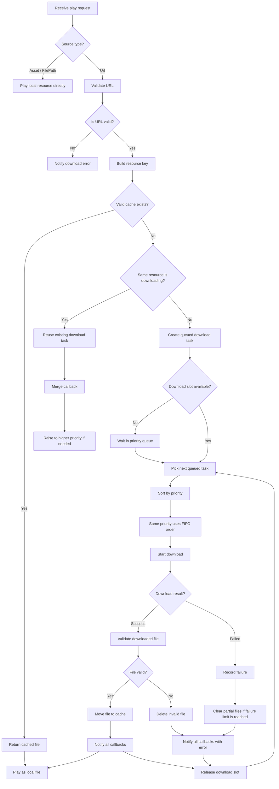

# GiftPlayer

An Android animation and room effects library for gift animations, interactive room widgets, and SVGA/PAG/VAP playback.

GiftPlayer provides a unified player view for multiple animation formats, with remote URL downloading, batch preloading, local assets playback, cache management, download priority scheduling, and simple APIs for gift animation scenarios.

## Features

- Supports SVGA, PAG, and VAP animation playback
- Unified `GiftAnimationPlayerView` API
- Remote URL playback with download and cache support
- Local assets playback
- Batch download and preload support
- Download priority scheduling
- Same-resource download reuse
- Multiple callback merging for the same downloading resource
- Configurable cache directory, cache size, cache age, and concurrent downloads
- Resume download support
- Optional audio playback
- Demo app included

## Install

Add JitPack to your project:

```kotlin
dependencyResolutionManagement {
    repositoriesMode.set(RepositoriesMode.FAIL_ON_PROJECT_REPOS)
    repositories {
        google()
        mavenCentral()
        maven("https://jitpack.io")
    }
}
```

Add the dependency:

```kotlin
implementation("com.github.KeShiJie.GiftPlayer:giftplayer:1.0.0")
```

Replace `1.0.0` with the GitHub release tag you want to use.

## Initialize

Initialize the library before playing remote animations:

```kotlin
AnimationInitializer.init(applicationContext)
```

Custom download configuration:

```kotlin
AnimationInitializer.init(
    context = applicationContext,
    downloadConfig = AnimationDownloadConfig(
        maxConcurrentDownloads = 2,
        maxCacheSizeBytes = 300L * 1024L * 1024L,
        isLogEnabled = true,
    ),
)
```

## Play Remote URL

```kotlin
playerView.playGift(
    animationUrl = "https://s1.videocc.net/default-img/donate-svga/diamond.svga",
    priority = AnimationDownloadPriority.Highest,
)
```

With callback:

```kotlin
playerView.playGift(
    animationUrl = animationUrl,
    priority = AnimationDownloadPriority.Highest,
    callback = object : AnimationCallback {
        override fun onComplete(request: AnimationRequest) {
            // Animation completed.
        }

        override fun onError(request: AnimationRequest, error: AnimationError) {
            // Handle playback or download error.
        }
    },
)
```

## Play Local Asset

Put the animation file in your app's `src/main/assets` directory.

```kotlin
playerView.playGift(
    source = AnimationSource.Asset("say_hi.pag"),
    format = AnimationFormat.Pag,
)
```

## Advanced Playback

```kotlin
playerView.playGift(
    source = AnimationSource.Url(
        url = animationUrl,
        priority = AnimationDownloadPriority.High,
    ),
    format = AnimationFormat.Auto,
    loopCount = 1,
    isAudioEnabled = true,
)
```

## Download Support

GiftPlayer includes a built-in download manager for remote animation resources.

Download features:

- URL resource validation
- Local cache reuse
- Single resource download
- Batch download and preload
- Download priority scheduling
- Same-resource task reuse
- Multiple callback merging for the same downloading resource
- Configurable maximum concurrent downloads
- Cache size and cache age cleanup
- Resume download support through FileDownloader
- Automatic conversion from remote URL to local file playback after download succeeds

## Batch Download

Use batch download when you want to preload multiple animation resources before they are played.

```kotlin
val resources = listOf(
    AnimationResource(
        url = "https://example.com/gift_1.svga",
        format = AnimationFormat.Svga,
        priority = AnimationDownloadPriority.High,
    ),
    AnimationResource(
        url = "https://example.com/gift_2.pag",
        format = AnimationFormat.Pag,
        priority = AnimationDownloadPriority.Medium,
    ),
)

AnimationResourceManager.preload(
    context = context,
    resources = resources,
)
```

Batch downloads use the same cache, priority queue, concurrency limit, and same-resource reuse logic as normal URL playback.

## Download Priority

GiftPlayer supports download priority scheduling for URL resources:

```kotlin
enum class AnimationDownloadPriority {
    Highest,
    High,
    Medium,
    Low
}
```

Priority only affects queued download tasks. It does not interrupt downloads that are already running.

If the same URL resource is requested multiple times while downloading, GiftPlayer reuses the existing download task and merges callbacks.

Priority order:

```text
Highest > High > Medium > Low
```

When priorities are the same, tasks are started in FIFO order.

## Download Flow



## Supported Sources

```kotlin
AnimationSource.Url(url, priority)
AnimationSource.Asset(name)
AnimationSource.FilePath(path)
```

Only `AnimationSource.Url` uses download priority.

## Supported Formats

```kotlin
AnimationFormat.Auto
AnimationFormat.Svga
AnimationFormat.Pag
AnimationFormat.Vap
```

Use `AnimationFormat.Auto` when the format can be detected automatically from the file.

## Modules

- `giftplayer`: Android library module for external usage
- `app`: Demo app showing URL playback and assets playback

## License

This project is licensed under the MIT License.
````
